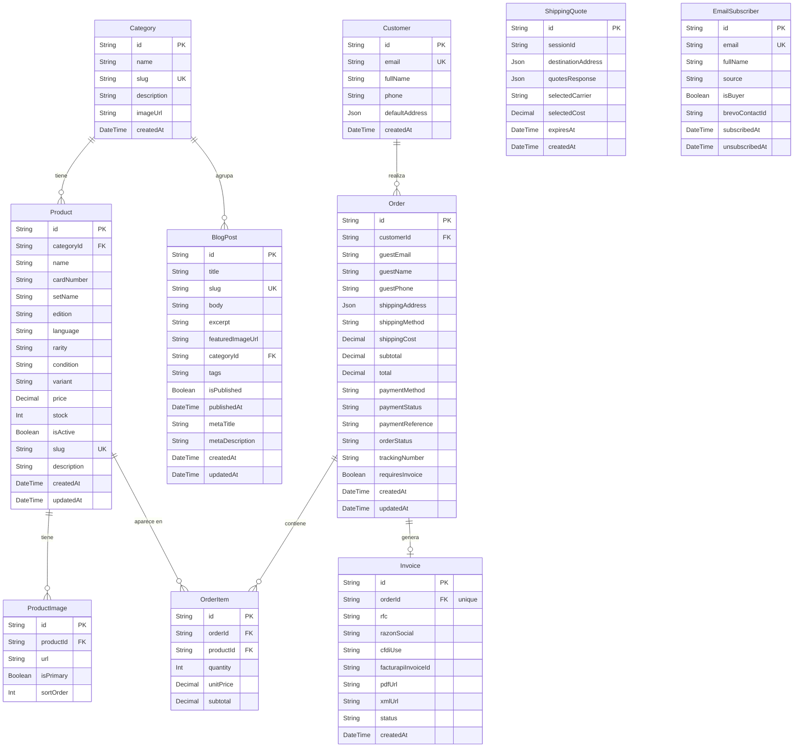

# Diagrama Entidad-Relación — Irving TCG Ecommerce

> Generado desde `server/prisma/schema.prisma`  
> Visualizar en: [Mermaid Live](https://mermaid.live) o cualquier editor con soporte Mermaid.

## Enums del sistema

| Enum | Valores |
|------|---------|
| `Edition` | `first_edition`, `shadowless`, `unlimited` |
| `Language` | `es`, `en`, `jp` |
| `Condition` | `mint`, `near_mint`, `lightly_played` |
| `Variant` | `standard`, `holo`, `reverse_holo` |
| `PaymentStatus` | `pending`, `confirmed`, `failed` |
| `OrderStatus` | `pending_payment`, `confirmed`, `preparing`, `shipped`, `delivered`, `cancelled` |
| `InvoiceStatus` | `draft`, `valid`, `cancelled` |
| `SubscriberSource` | `homepage_form`, `checkout`, `manual` |

## Notas de diseño

- **`Customer.id`** no usa `cuid()` — se establece externamente (Clerk user ID).
- **`Order.customerId`** es opcional para soportar compras como invitado (`guestEmail`/`guestName`/`guestPhone`).
- **`Order → Invoice`** es relación 1-a-1 única (`@unique` en `Invoice.orderId`).
- **`ShippingQuote`** es efímera — persiste la cotización de Skydropx con `expiresAt` para no recotizar si el usuario navega hacia atrás.
- **`EmailSubscriber`** es independiente de `Customer` — un suscriptor puede nunca haber comprado.
