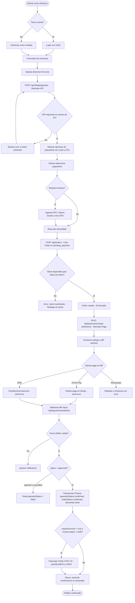

# Flujo de Checkout y Pago — Irving TCG Ecommerce

> Cubre desde que el cliente inicia el checkout hasta la confirmación del pedido.

## Puntos clave del flujo

| Paso | Detalle técnico |
|------|----------------|
| **Cotización Skydropx** | Timeout 5s; si falla se muestra error y se permite reintentar sin bloquear el checkout |
| **Validación de stock** | Ocurre dentro de la transacción Prisma en `createOrder` — elimina race condition TOCTOU |
| **Preferencia MP** | Se crea solo para métodos OXXO y SPEI (tarjetas de crédito excluidas por `excluded_payment_types`) |
| **Webhook MP** | El backend responde 200 inmediatamente antes de procesar para evitar reintentos de MP |
| **Firma HMAC** | Verificada en producción con `PAYMENT_WEBHOOK_SECRET`; en dev se omite si no está configurado |
| **Stock decrement** | Usa `updateMany` con guard `stock >= quantity` para nunca llegar a negativos |
| **Factura draft** | Se crea en la misma transacción de `createOrder`; se emite (Facturapi) solo cuando el pago se aprueba |
