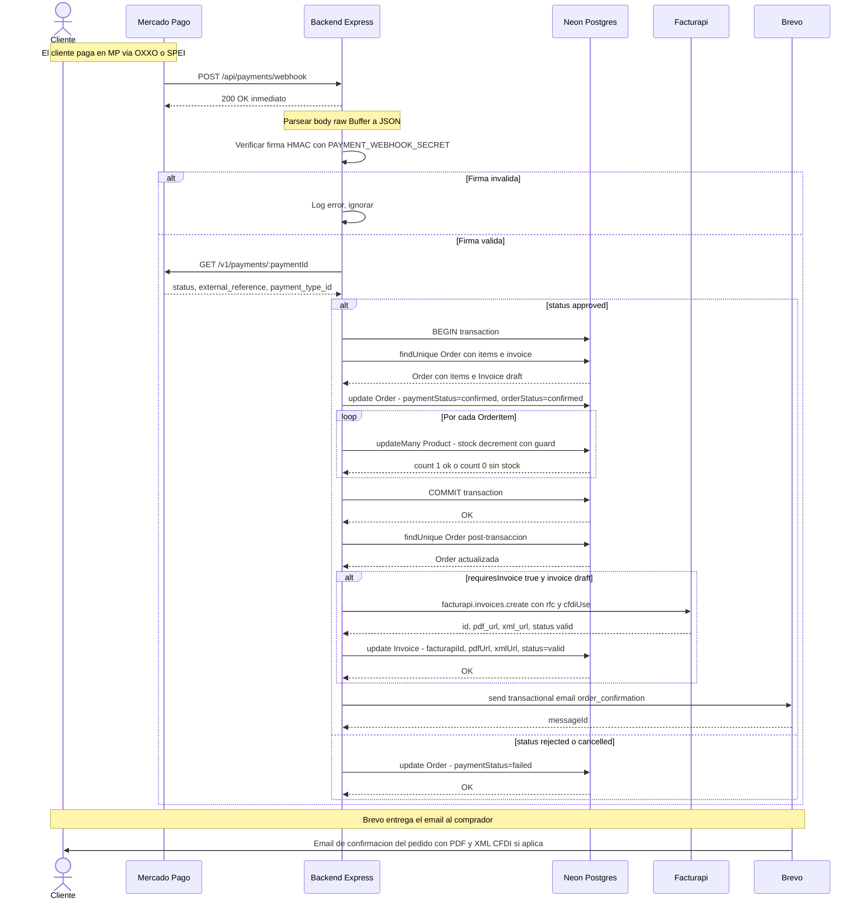

# Diagrama de Secuencia — Webhook Mercado Pago

> Detalla los actores y mensajes del flujo asíncrono post-pago,  
> desde la notificación de MP hasta el email de confirmación al comprador.

## Garantías del flujo

| Garantía | Mecanismo |
|----------|-----------|
| MP no reintenta si el backend falla | Se responde `200 OK` antes de procesar |
| Nunca stock negativo | `updateMany` con guard `stock >= quantity` |
| Factura solo se emite una vez | Guard `invoice.status === 'draft'` antes de llamar Facturapi |
| Firma auténtica de MP | HMAC-SHA256 sobre `id:ts:request-id` con `PAYMENT_WEBHOOK_SECRET` |
| Errores post-transacción no abortan el flujo | Facturapi y Brevo usan `.catch(console.error)` — fallos son silenciosos y reintentables |
