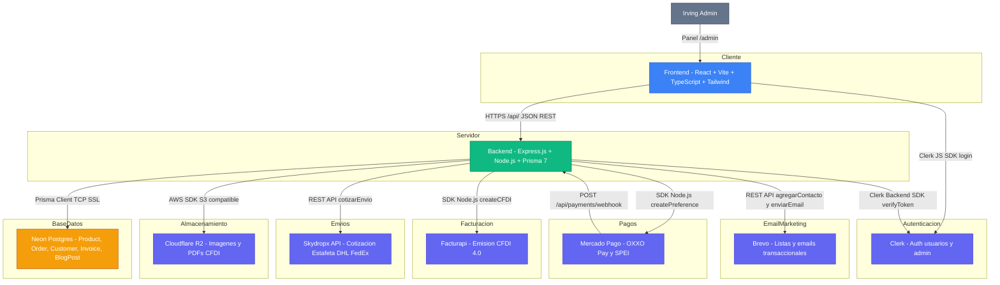

# Arquitectura de Componentes — Irving TCG Ecommerce

> Diagrama C4 nivel 2 (Contenedores). Muestra los sistemas, sus responsabilidades y las integraciones externas.

## Responsabilidades por capa

### Frontend (React + Vite)
| Responsabilidad | Tecnología |
|----------------|------------|
| Catálogo con filtros combinados | React state / URL params |
| Carrito persistente | localStorage |
| Autenticación de clientes | Clerk JS SDK |
| Formularios con validación | React Hook Form + Zod |
| SEO y metatags | react-helmet-async |
| Animaciones | Framer Motion (si se activa) |

### Backend (Express.js)
| Responsabilidad | Detalle |
|----------------|---------|
| API REST segura | Helmet, CORS restringido a `FRONTEND_URL` |
| Autenticación admin | Clerk JWT verification en middleware `authAdmin` |
| ORM y acceso a DB | Prisma 7 con adaptador `@prisma/adapter-pg` |
| Integración pagos | Mercado Pago SDK — preferencias + webhook HMAC |
| Cotización envíos | Skydropx REST API con timeout 5s |
| Emisión CFDI | Facturapi SDK Node.js |
| Email transaccional | Brevo REST API |
| Upload de archivos | AWS SDK S3 → Cloudflare R2 |

## Variables de entorno por sistema

| Sistema | Variables en Backend |
|---------|---------------------|
| Neon Postgres | `DATABASE_URL` |
| Clerk | `CLERK_SECRET_KEY` |
| Mercado Pago | `PAYMENT_ACCESS_TOKEN`, `PAYMENT_WEBHOOK_SECRET` |
| Skydropx | `SKYDROPX_API_KEY` |
| Facturapi | `FACTURAPI_API_KEY` |
| Brevo | `BREVO_API_KEY`, `BREVO_MAIN_LIST_ID` |
| Cloudflare R2 | `CLOUDFLARE_R2_ACCOUNT_ID`, `CLOUDFLARE_R2_ACCESS_KEY_ID`, `CLOUDFLARE_R2_SECRET_ACCESS_KEY`, `CLOUDFLARE_R2_BUCKET_NAME`, `CLOUDFLARE_R2_PUBLIC_URL` |
| URLs internas | `FRONTEND_URL`, `BACKEND_URL` |
