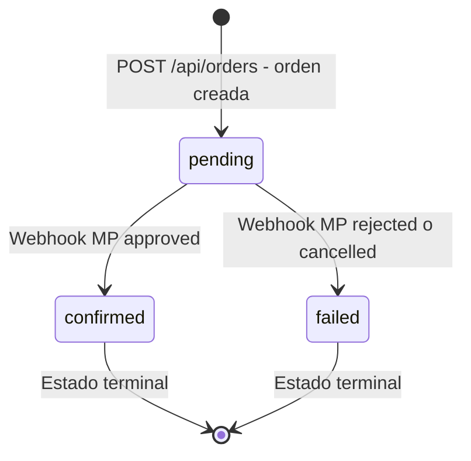
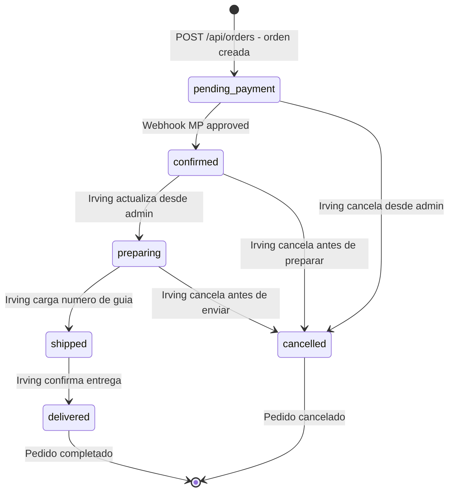
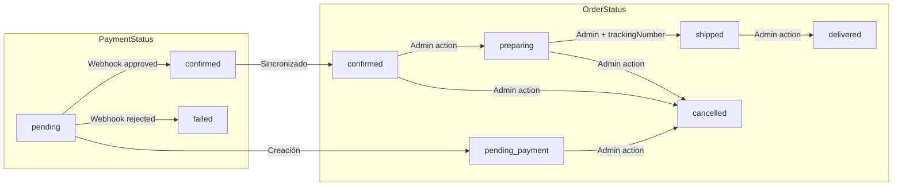

# Diagrama de Estados — Ciclo de Vida de una Orden

> Muestra las transiciones de `OrderStatus` y `PaymentStatus` y qué evento las dispara.

## Estado de Pago (`PaymentStatus`)

## Estado del Pedido (`OrderStatus`)

## Relación entre ambos estados

## Resumen de transiciones por actor

| Transición | Actor | Mecanismo |
|-----------|-------|-----------|
| `→ pending_payment` | Sistema | `POST /api/orders` |
| `pending → confirmed` (PaymentStatus) | Mercado Pago | Webhook automático |
| `pending_payment → confirmed` (OrderStatus) | Sistema | Webhook automático (sincronizado) |
| `pending → failed` (PaymentStatus) | Mercado Pago | Webhook automático |
| `confirmed → preparing` | Irving | Panel admin |
| `preparing → shipped` | Irving | Panel admin + trackingNumber |
| `shipped → delivered` | Irving | Panel admin |
| `cualquiera → cancelled` (antes de shipped) | Irving | Panel admin |
